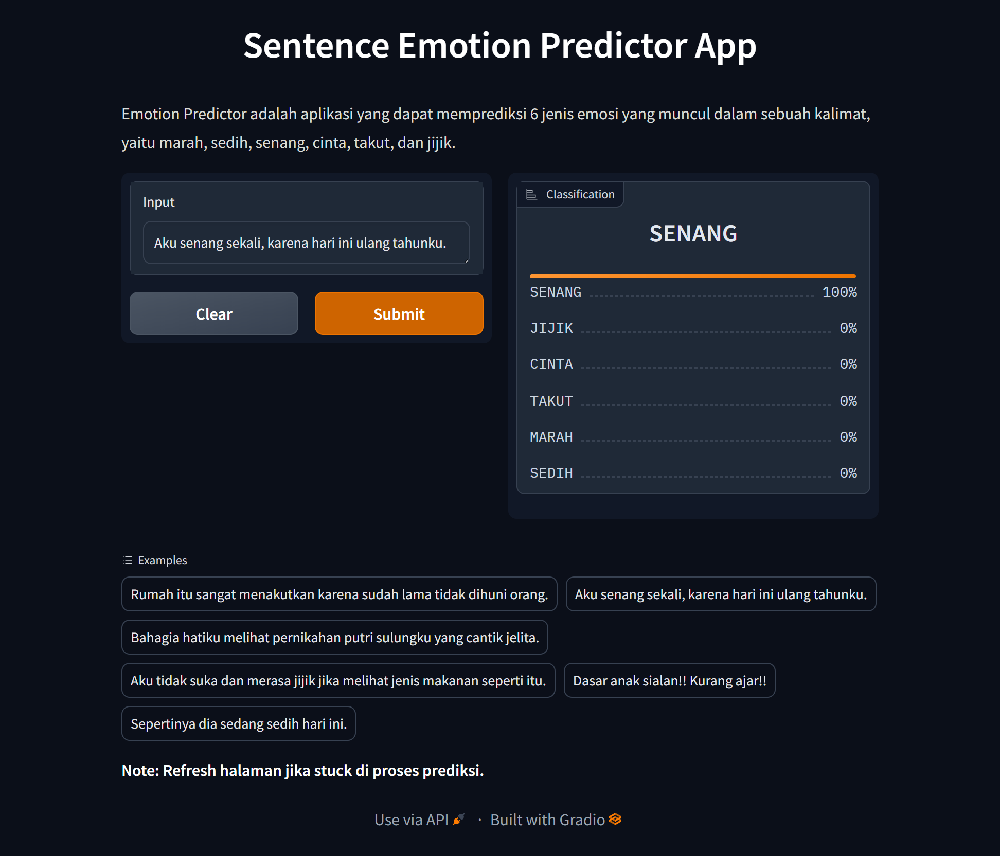

# Prediksi-Emosi-App

Prediksi Emosi adalah sebuah model Deep Learning berbasis IndoBERT yang dapat memprediksi 6 jenis emosi dalam suatu kalimat, yaitu marah, sedih, senang, cinta, takut, dan jijik. Model ini dilatih pada dataset yang diperoleh dari website Twitter/X  melalui metode crawling, dan dilakukan proses pelabelan secara manual oleh peneliti. 

Model pre-trained yang digunakan pada penelitian ini adalah [IndoBERT-Base-P1](https://huggingface.co/indobenchmark/indobert-base-p1 ). Sebelum proses pelatihan model, preprocessing dataset dilakukan untuk membersihkan teks dari karakter-karakter yang tidak relevan untuk kasus prediksi emosi.

Hasil akhir model di-upload ke [Hungging Face Hub](https://huggingface.co/docs/hub/en/index) dan di-deploy ke [Heroku](https://www.heroku.com/ ) melalui API [Hungging Face Inference Endpoints](https://huggingface.co/inference-endpoints/dedicated) yang dapat diakses melalui [Sentence Emotion Predictor](https://emotion-predictor-app.herokuapp.com/).

- Model on HunggingFace : [Prediksi Emosi](https://huggingface.co/azizp128/prediksi-emosi-indobert)
- IndoBERT Pre-trained model : [IndoBERT Base Model P1](https://huggingface.co/indobenchmark/indobert-base-p1)

## Screenshot

